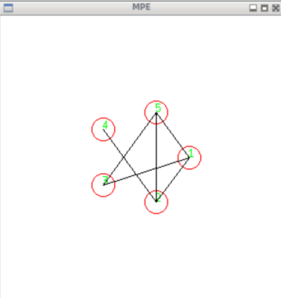

# SRIR - Algorytm Floyda

## Spis treści

- [Struktura plików](#struktura-plików)
- [Dane](#dane)
- [Instrukcja obsługi](#instrukcja-obsługi)
- [Przykłady](#przykłady)

## Struktura plików

```bash
Floyd-algorithm-parallel-computing│
├── src/
│   ├── `floyd.c`
│   ├── `graph_viz.c` - podstawowy przykład z kodem wizualizującym graf przy pomocy MPI oraz MPE_graphics
│   └── `main.c`
│
├── include/
│   └── `floyd.h`
│
├── `CMakeLists.txt`
├── data/
│   ├── source/
│   └── result/
└── build/
```

## Instrukcja obsługi
Aby program zadziałał należy przejść do folderu build i wykonać komendę:
```bash
cmake ..
```
A następnie
```bash
make
```

Abu uruchomić program należy przejść do folderu build i wykonać kolejno komendy
```bash
cmake ..
make
```

Wywołanie programu na przykładowych danych na 3 node (z folderu build)
```bash
mpiexec -f ../nodes -n 3 ./floyd 5 ../matrix_diff.txt
```
Plikowi wykonywalnemu (tutaj ./floyd) należy dostarczyć dwóch parametrów wejściowych: pierwszym argumentem jest rozmiar macierzy sąsiedztwa definującej graf, a drugim nazwa pliku źródłowego, w którym ta macierz się znajduje.

## Przykłady

> 
